# MGDM2OEREB Trafo service

This setup ships with the following components:
- [mgdm2oereb_service](mgdm2oereb_service/README.md) (pygeoapi based endpoints for processing)]
- [mgdm2oereb_frontend](mgdm2oereb_frontend/README.md) (simple GUI to configure and start transformation and see status of jobs)
- [ilivalidator_service](ilivalidator_service/README.md) (a sidecar to validate input and output INTERLIS files)

For more details about the components look into the readmes inside the corresponding folder.

```mermaid
graph TD;
    service[OpenAPI Job Interface]
    gui[WebGUI]
    validator[ilivalidator-web-service]
    gateway("API Gateway 🔒")
    
    gateway---service
    gateway---gui
    gui---service
    service---validator
```




Example input data:

NOTE: The value of `zip-file` is the files content encoded as base64.

```json
{
  "mode": "async",
  "inputs": {
    "zip_file": "UEsDBBQAAgAIAFluVFWyZBv3EhAAANZjAAAqAAAAY2guUGxhbnVuZ3N6b25lbi5zaC5tZ2RtX29lcmVibGV4LnYxXzEueHRm7Z3rUhvJkoD/b8S+A8Gv3XCoVPfLCZkTQggjjCTQBRn+OFqt1gUkgaUWAh5kn2Df5LzYyRZgS12iSvZgzO4wMWOsVn9VmVmVWVnZXUzun7ej4dZNNJkOrsYftwnC21vROLzqDMa9j9vNxn5Gb/9zJ9eo5Sv1/WJtC+4eTz9u9+P4+h/Z7Hw+R4NxHE2GgykK+9lSpVGsHZXqFLHtnf/8j9xBMb9XrNWLhUapWtmqFyvw6eP2YDig170MRwrhjOjijqJGUczb2GhBZRh1hJTEBNx0uiYS3Q7vsPb21im0BM183F60nitX94pH9cefW5V8ufhx+3gYjGfj3vT+ahyNv56Sr2QZw5RkCPxrtreatdKDElPQYnTViYZT1IuuUNAZDcaJJvlaMQudZBetP/2E3rIrKiU67uUb+aWPtgjoU3TVDqaDaSeIo/HWbmnv43bYR9SI1Ffbm/CocXf9dfmmrcZyg9f38d01ktTAQO7kCqDZzuL64goiueziUm43uo8GYT9pZGelse3BaKs1GLT/9b+T3nYuu3xfLt++nEWT+wVznssufcztR9N4GPXg71/r8awb7XyKRtFg3IlyWeurXP1u1L4aghClyu7RbvXLzuB0t1qb48+feld5+KdSb/aLzR78rRgmny8K+RL82D2Meb6Y/KXfGu6dkN3DE1zuhQeHN+ej4fT8JJ//fLhvLhukNMf58PbUNK6bzcneDPf4daFfHV6eHNUPq81pc9Aq9OP+6VmnUVCmNzir1M9mR1cfdoPwePdiGk16/NvdpCenvcKBzFf3rsTn9nVp0DVHhQEZHO9dzG5VrC5UzHqVwrRc+TIdnew2J63gkl8Ub0dketoNsvMS73+4L5S+lU8rx9e74X24S7omuzc3dVWYmvvjbOPy0/Do/jBfMqXjcgdf4UCfNO5Mq1MW6rZ60CoO64Pyh8PbOZWl4+IFoa0Ddt/70q6d8/PpRem6Ghye6NpgenYzPBqdDU/uWtXiVXh6GlR0KZrN5+PR0ZR8u55mz8yHk+le1MLD+y+tAOS6KJxcXpaah58OWqfNZrFaPL3CzeLdOLhQY96nJHs5nN/Nwuue2O/n9+tXl3Se/bCrPqjKSdy4xKJeyrfxzfCidXt30aPz02AvvJHHk2BKeuNe9ySYxSWZpb3a6PhyeNM5asyLjQLfO70NO/c1sacuwvxZEHXKo5N2eXjUvOs1e8fh/YdvZ2HxaL7/IQ5CFk9U9QDny3HjVPfIPMwPyvv1oWLRl052pqLsBWuomT7IVyt3vBJd40oyTfKHYbF/Hs7z+aNBOZ8v8Iv8l8HwmJ0l3x10isNK7aQ7KuyWy4Xa3R2MQJx88elLbb91UNtrUxKftwTOFyt35619fN466XXoEAeF3YN6k5yc8mJ1H9rO78eHteJ+s1U+junnYm1eyJdP9g+COa1+m2U/3O5ez3qfaWGvNbqu9b/cdGttcXRakvWWGczKH+ZnpDHZD9uDm/izvDyO8X5zuF9rnq7778DMyuYgGt9/o/3mKflycrN/2SydX4bHdHKyULjePK3WPovCWan0EXz1yZ1y2ScPy/50NNkoBNnhp93hXYmDbiaMwijDacgzbWOiDEzqkBLDwq6kEI+gmVEUTwZJEGjW9vOFIkSBarOyl6+d7eSOq0dnR6UKXCtUq7U9+EF2qNREUowESWIXgWt0h1BDqISligi4RkHNp/tXMGEEgp+rmGDISDemJcKUpTCKCFZOTEikOF3FuER00dTzGOVIs5RuzCBNsBMjBAlDLYwTp5DcwCrATUpIsCSmbowgkx4ATBGWxIkllmSrQhJpkDHa3VuCiRSmHs3kNEl6AIgUYEnqHgCFGCcpTCKD3b1JmEipcSOKICbcvWkBA5DSTUFT1NmbxOABWNoYc/YmYWiZ5jYmuRNjCkmRElIb8EHpxhiiAqdmCYybdmObenf2R3zI/gga2e+BJLsUXa5n7eHgfhBN4nx7h2JiMgRnEk9c+WLptt3BFO6j1L4v+SZXi8J+PJ3GQTyb7gzGnydBN85lV67mIJQen2/B2vBcNpZd3LFJVP7piLxo+eve1eVsFI3jn5Dl9GoyDfuTQTdevbs3aSMikjw7++OWDReUZUlAeC/zjIYP1r353ns6d7a/3964JfQk4Gr2/ENrUANy2GkU3w8h/40+TWbjzjDoRQvDwdeDOIL19egqDGDrE8SweSocQGeoPBvGsL8Z92bBsBHdxt/viTorH5eQ9A1BAveinSR5/v4ht/jyX/9TK+4Oo1uQYnFv1tta9pnPTpGzj+pVu93EB4bDqDL5Pcou/gSL/26FVjVJLpZGrQgiwJrZsow3JwNLqTXI9zse7neM4NOe8yqaRG0YSTTtJ9vN4HqQhf0n9Ho5zRqOUT8eDb8bxdujZZRN1MoumSE/m97PeiXYsN3uEIwhiC9f2Sj8/bWQS62Qm/05R34u0tjIM0GiMQnG0240KUdxsGanbn29vWk7KD9Kh5nHzfFNNJkHwxgagIhTCUbR60eUp3361m7U60En0fh3u+KDnmCTP+yB7SeFE//73a72Q93zaDCMyFq7P361tsm1s2rjGbiX/NmOwFXHndWpuPh+cR2m4G4wvYzi0t5W1VGjguTr8TbYxCXgirM/XMndz6DNaNwZ9KJ6nITdVHaxzgGyFrSpKZbVey4OWNRPFuuIeuFiHTS4tlgH1zcu1rVgvYiGmeJkDNEtjuaD6XvN7r1m916ze6/ZbVCz63Tb7VC3ZSbshizDqTIZ04V0jEWhpm0qDDXtX6zZGco1RYqtVNEwZQoRbJ4vBgBmOJJKrmICIyW1D3uoYS1jFAnh6Y0hvKiYLWFSISHdmGaIUbyKaYmYqxoDmDKIqpSQIIEW3I1JhFerMZhhjKSrjJkIyZHmOIUJRAzxYXK1+gkY6EbcummNCJMWpl3VzwTDSGi9ilGFqCY+S5I0xhjirgJVgmmwJE1hGnTTvgFQNIVxBmZSbowiLswqJgnizG0SyRGYZRVLvEJIn0mYSY2bgQmH3UIagYRZnVwcU6QxdmECdqgkjREwkyBuTCNBdQqDfEcbN6YQlsrSDROPkCAQUZYlBXOaRDCDFE/5G0wBQrUbI4imMQGzRDu9G8yBuEoJCYIzJd0YjJFOYSCBJMI3AEqRlL8RZJRbSEUfq7hLGKHIuGOJMDBuOB2CkkjtHm6tkKGpqKyS8rNbSIjKae+mUoIPKp9uhqQwnpjE6aZCQsBLmYTCAGjmFlLCokRXZwmlILgWvqn88EBiCSMCGe2eJQxWTpJahLFB0h0UBIFbUlOZJksHdpuEgG+lV1PMIAS5hxsEYiJlSQhB3DMnYSJppVMYSGDcq6lJ4mRKN5jKknlW0w3Tmb/wkAJSL8wyyST3VMzE4r6XeUhh7UJ/40MKOwWlIeXdgHQy4ErdDMdcZIwISEbTkAU4ENSEwS+noJIQcFFmRS3tzhKkgJmueCpNg6FWXgynfc0kmYPT1ySHpT2VONFFSHL3xpL5mBKSC/Bs5+yXsNoQY1IYhFvuDOQSPBvzlGdDUxDNfBhP+xqFppRHSHDH1JJIYZ56V5vkgfSqJYmGiGyoO/5LJFefpGMiGew43MEOhlvQ1YhMIJdUxh1a+VMCuIQJSEvdyXzSm0qtbTBHEfcEclikDDEpkxhfCiokhr1MerWBqay8vWGeWklhKfGtpAoWW4atycW5G9NJuplyHMidtSdNg1mSera9SC6Yx3FgHRM8lTjBwkUZ8WKpRSrBmFvIBJNEWhinwosJGxPUK6Q0tpDSE4IAU2tMooi3N6VtITX26qYZszHjtaTWtpDGYB+WersDlg4MaZpXN6OphRHlwXj6hZcFRqUfM9jCmMA+jHBpYdy9LUowipmFCcq9mLRNIolXSEbt3qTx9sa0bUmltA/jXFuYll4hBbGF9K2mCaZShQHIVTClPkymFuEEI9jbm0rHkgRTxotpG6NC+DAttIUx5hXS9jdYKn1BAXIuLGzMN9yApUssyQt13PgwIuwBkBT7MMpsIT1FjwRjhFuYEtKLGRvTvsklwGr2cD/UGJyYWDPcRhAfJjm1MvOH/NmJKWqXIbDyYprYvRHmNYk2xsaMd7jNmloJ5Z5xk6CHsDCGsQ8jktuYYD6MCrs37suCJGLc1o0LL8aZtjCBqQ8TVlCgfjeFhJ7augnjFVJRbGHStyxKmFx2b1J5hUy9UbvAFPFgSUXNtqQS2ocRbAupfCZRa5Z82EBTr5AM2/6mJfNhHNsm0X4hBbbHzVAvJtdhgvowtUZIo7wm0ZZJGIyl1yQGcxujnlii1yyL7HEL78SINbnYY+ndiVGCbUxzH8as5ImBBNiHcSudAYx4exPE2JjfktbTsARjXpPYCxV7TLudmGa2JYlvTsIun/E1mEdIA7sOe7iJb9dhQA+6BqM+jHL5KxgTa0ziy8zN46KUNon0YXY6k2De3qRcYxLu1U1JsWZyMR+m5bqp7O3NqDVCuqvzMtn1qjWxxBOVF7veNbHEk5knu169JpYIr5BMrwmvzItxvSa8Eq+QQos1T8O8JpHrHqJJr5BqHeaZXMn2dR3mSbGT7esaTGtPb+TxEVYK8zjOphX696cqv37041lZ1h79gLuTQxCfahmMMTVv9vwHyPnS5z9s1d8PgbzeIZAns7+fBFk+CSL0//2TIM9F4Ld0wAN8/8UOeCRx5A0e8Di66o+3/qt+8N9/lwMeyS8nGYLSf/Z8x5LZX/18B8xE3/kO+1jDuvMdP1x4g/Mdz83/t32+A/MXPt8BDa4935E8xtn0fEdxMo9gFYa8o7dVD/uzYT+YvR/xeD/i8X7E4/2Ixybv1wkcdqUhNENlGGR40A0ymqgoEyqe/GKtNg463V98v04ZKdRjXeBp966pocZdBwFMYaRWanOAMYKYEk5Mk1QFN8EoEgw7MUMRXalMJFjyWrazN5U8612pTCSYQNhVrEkwidjKW2GJSRhSSviwh7ekljCSPEUhTowLpHm6N4Uo4W5MPz5nWsaE+20HwIRAkqwOt1YEmqJuTIH6KUzwx1eHHBhPPVVIMIKwcQ8AT87Y6FUMrknPABCOiEhjEmGPJZNHVhynxu3p7UXHnIQUwKSx5N0K4/aA5PfE6BSGYU5St78l5fIUljxpkNKJSfz4+sUylujr1m3ToPBXSno4g00mKRV4SnpscZ9+kZKelc79wZLes7KsLenB3d/rWoTIN1vSAzlfuqRnq/5e0nvlkh5JavnvJb2lX+6i/h+U9P5qBH5LtT8IEi9W+0sCzhus/VWi2fhyMAn7f6fa3/hJ6T9bAFyy/asXAGE6+gqAdt1rbQHwu8NvUAB8zgnedgEQ0mS7APhbEh3o6ZlE57fFOOjyxWIctPUWYxyIPQ06f5tfYfUY5OIfWqOl8P7qUW7F+r8U536HT8tX82n5+j4tX9Cn5dv06Vowmv6t3HmyUPiPevKTzd+IE8MW6lVcGPp5XQeGDte778Y2zKb+1xPZp/9Lx86/AVBLAQI/AxQAAgAIAFluVFWyZBv3EhAAANZjAAAqAAAAAAAAAAAAAACkgQAAAABjaC5QbGFudW5nc3pvbmVuLnNoLm1nZG1fb2VyZWJsZXgudjFfMS54dGZQSwUGAAAAAAEAAQBYAAAAWhAAAAAA",
    "theme_code": "ch.Planungszonen",
    "model_name": "Planungszonen_V1_1",
    "catalog": "ch.sh.OeREBKRMkvs_supplement.xml",
    "oereblex_host": "oereblex.sh.ch",
    "oereblex_canton": "sh",
    "dummy_office_name": "AGI SH",
    "dummy_office_url": "https://sh.ch/CMS/Webseite/Kanton-Schaffhausen/Beh-rde/Verwaltung/Volkswirtschaftsdepartement/Amt-f-r-Geoinformation-3854-DE.html"
  }
}
```

Need to be sent as POST to URL:
```
<url-to-service>/oapi/processes/mgdm2oereb/execution
```

